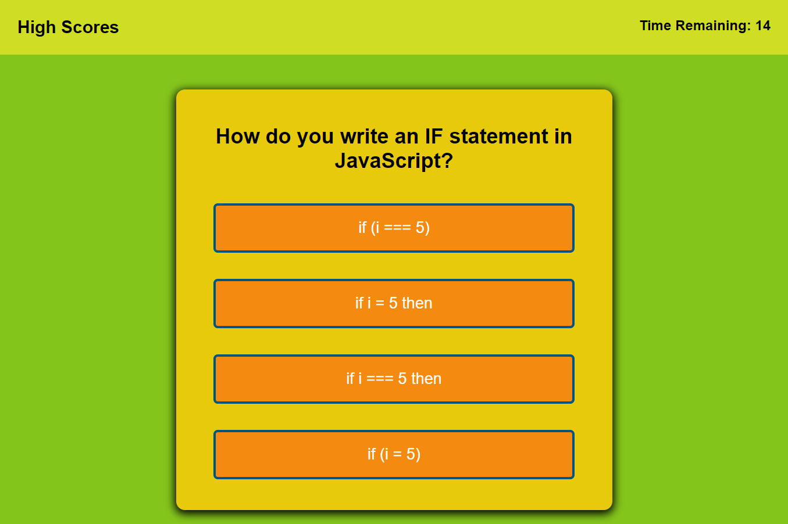

# javascript-quiz

This project is a timed quiz on the fundamentals of JavaScript. The game will have 50 seconds timer limit. 5 multiple-choice questions will displayed, a correct answer will award 10 points, incorrect answer will subtract 10 seconds from the timer. When the last question is answered, or when time runs out, the player will be taken to a results page where they can input their initials for score keeping. When submitted, a high score chart is updated and saved locally.

### Deployed link
https://xbaderm.github.io/javascript-quiz/

### Screenshot

